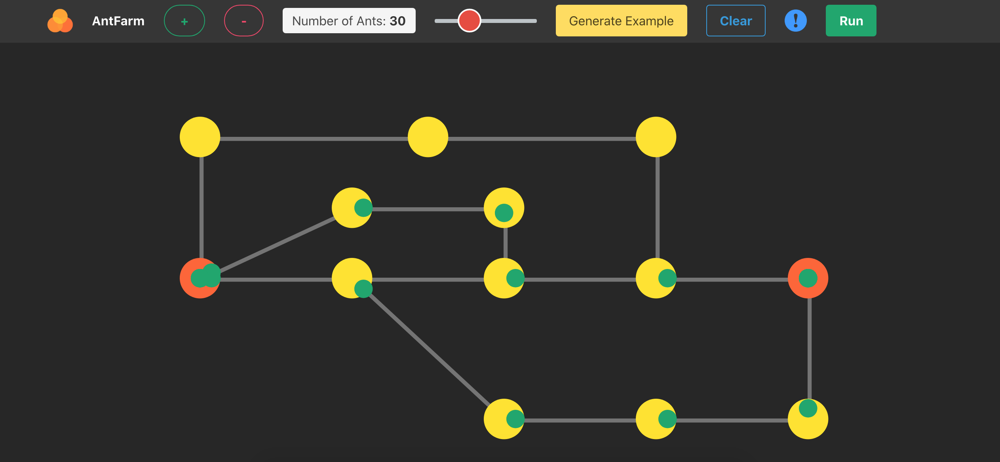

# Ant Farm

Visualise the movement of ants in an ant farm. This app is extension of [lem-in](https://github.com/01-edu/public/blob/master/subjects/lem-in/lem-in.en.md).

### [Visit the site](https://www.antfarm.ml/)

## Technologies
### Overall
* Docker
* docker-compose
* Travis CI
### Frontend
* Javascript
* Webpack
* Fabric JS
### Backend
* Golang

## Project description

* You make an ant farm with tunnels and rooms.
* You select desired number of ants to go from start to end rooms.
* You observe how algorithm finds the quickest way for ants to move in an ant farm